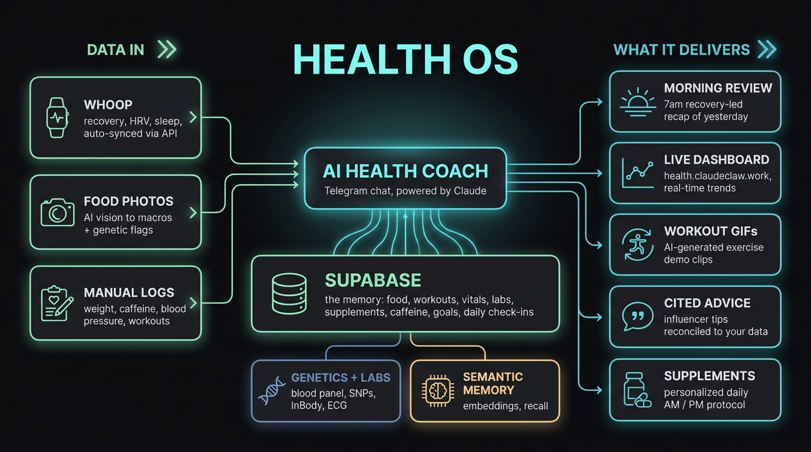
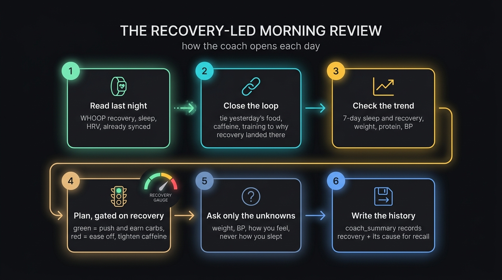
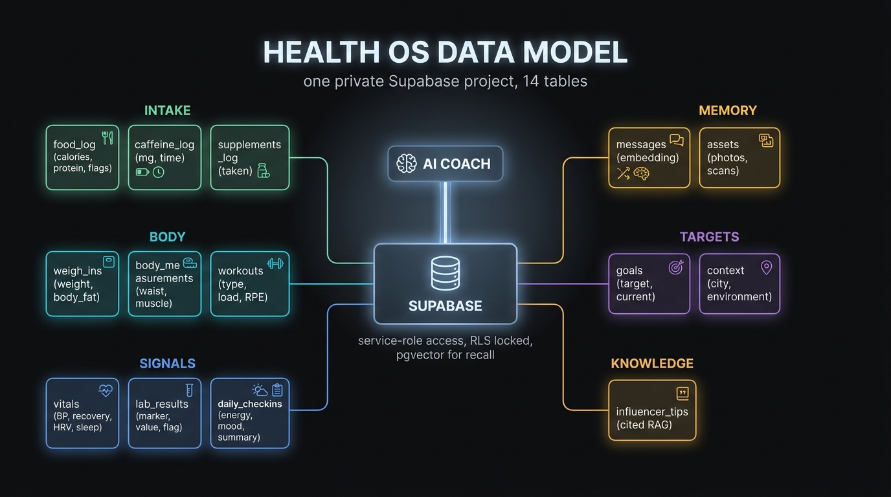
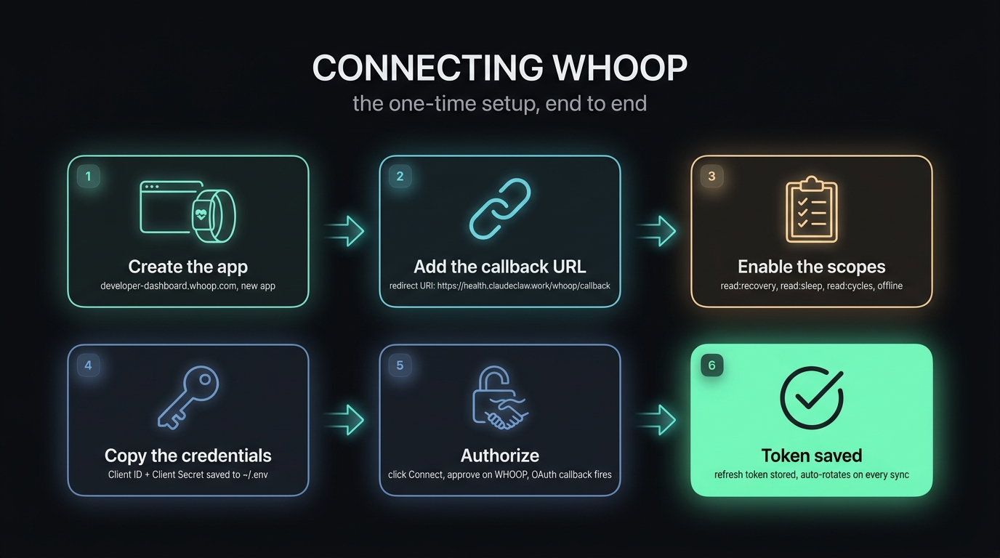
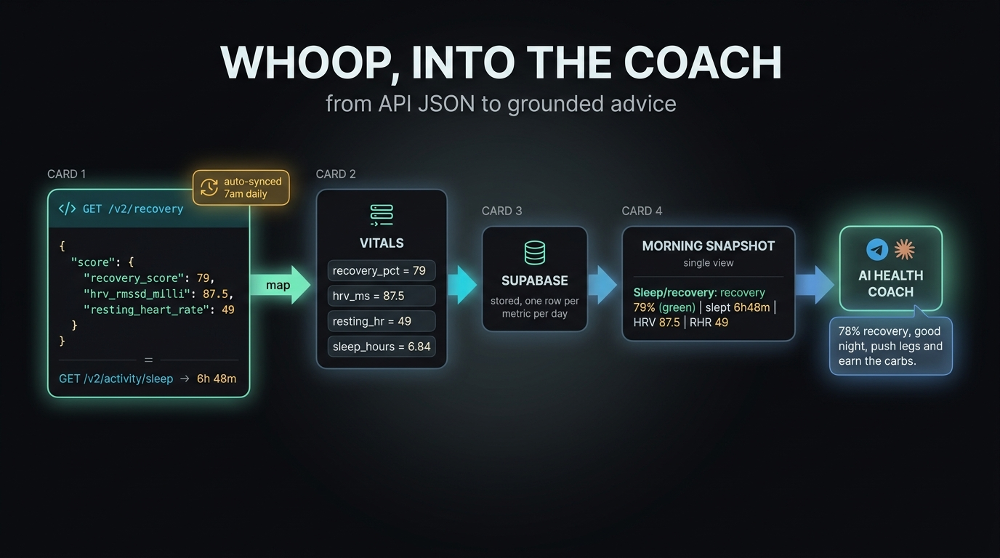

# Health OS — a personal AI health coach agent

A turnkey blueprint for a **personal health coach** that lives in Telegram, remembers everything in its own Supabase database, and grounds every call in your real data: your wearable (WHOOP), your food photos, your labs, your genetics, and your goals. Clone it, point it at your own Supabase project and bot token, and you have a coach that reviews yesterday, reads last night's recovery, and tells you whether to push or pull today.

> ⚠️ **Not medical advice.** This is a software blueprint, not health guidance. Everything here is simply what worked for one person who consulted their doctors at every step. It is not a prescription, diagnosis, or recommendation for you. Talk to qualified clinicians before changing anything about your labs, supplements, training, or diet. The AI coach can be wrong or hallucinate, so treat anything it suggests as a question to bring to your doctor, never an instruction to follow.



> This is a **template**. Every value here is generic or an example. Bring your own data, your own bot, your own Supabase project. Nothing in this folder contains anyone's personal health information.

---

## What it does

- **Logs everything by chat.** Weight, food (from a photo), workouts, caffeine, supplements, blood pressure, labs. The coach extracts structured rows and writes them to Supabase.
- **Reads your wearable.** A daily job pulls WHOOP recovery, HRV, resting HR, and sleep into the `vitals` table over the official v2 API (see the WHOOP blueprint below).
- **Runs a morning review.** A scheduled job opens each day by leading with last night's recovery, tying yesterday's food/caffeine/training to how you recovered, then giving a recovery-gated plan for today.
- **Answers on demand.** "Should I eat this given how I slept?" pulls last night's recovery and answers from the number.
- **Remembers semantically.** Every message is embedded; the coach can recall "what did we decide about coffee" weeks later.
- **Stays grounded.** It reconciles advice against your own labs and goals, which always win.

## A day in the life

A typical day, all in Telegram. Illustrative example, not real numbers, and not advice.

- **07:00** the morning check-in fires: "Recovery 71% (green), slept 7h20m, HRV 64, RHR 52. Yesterday's protein hit target and caffeine was early and modest, that clean run is why you're green. Today is a push day, put carbs around the session. Weight this morning? Any BP?"
- **08:30** you photograph breakfast: "~38g protein, low saturated fat, logged." (writes a `food_log` row)
- **13:00** you ask "coffee now?": "You're green and it's early, fine, keep it under your ceiling and cut off by mid-afternoon."
- **19:00** "steak and a glass of wine": logged; the coach notes the alcohol may dent tonight's recovery.
- **Next morning** the loop closes: "Recovery dipped to 48% amber, the wine and late meal are the likely cause. Ease off today, lean on protein, fiber, and hydration."

Every number above is illustrative. Your coach's outputs are only as good as the profile you give it, and should always be checked with your doctor.

---

---

## Architecture

```
DATA IN                      THE BRAIN                       WHAT IT DELIVERS
WHOOP  ───(v2 API, cron)──┐
Food photos ──(AI vision)─┼─► Supabase (the memory) ─► AI coach ─► Morning review
Manual logs ──────────────┘        ▲                  (Telegram     Live dashboard
                                   │                    + Claude)    Cited advice
                          Genetics/labs + semantic memory            Supplements
```

The agent reads a compact **session snapshot** (`scripts/state.py`) at the start of every turn, so it always has your weight trend, today's intake, BP, last night's recovery, and the 7-day sleep/recovery pattern in context before it answers.

### The recovery-led morning review



---

## Data model (Supabase)



The whole store is in `supabase/migrations/`:

| Migration | What |
|---|---|
| `0001_init.sql` | All tables + pgvector + RLS (service-role access, anon reads nothing). Pure schema. |
| `0002_seed_example.sql` | **Example** goals + context rows with placeholder values. Replace with yours. |
| `0003_match_messages.sql` | The cosine-similarity RPC for semantic recall. |
| `0004_influencer_tips.sql` | Optional RAG table for cited coaching tips. |

Tables: `messages`, `assets`, `weigh_ins`, `body_measurements`, `food_log`, `workouts`, `supplements_log`, `caffeine_log`, `vitals`, `lab_results`, `daily_checkins`, `goals`, `context`, `influencer_tips`. Sensitive health data, so RLS is on with no policies; the coach uses the service-role key server-side, and a leaked anon key reads nothing.

---

## WHOOP integration (the headline blueprint)

WHOOP is the model for adding **any** OAuth wearable. Two parts: a one-time connect, then a daily sync.

### 1. The one-time setup



1. Create an app at **developer-dashboard.whoop.com**.
2. Add your **redirect URI** (this repo handles it at `https://<your-host>/whoop/callback`).
3. Enable scopes: `read:recovery read:sleep read:cycles offline`.
4. Copy the **Client ID + Secret** into `~/.env`.
5. **Authorize** once (visit your connect URL, approve on WHOOP).
6. The callback exchanges the code and saves a **refresh token** that auto-rotates on every sync.

### 2. From API to the coach



`scripts/whoop-sync.py` (run by cron each morning):
- Refreshes the access token. **WHOOP rotates the refresh token on every refresh**, so the script persists the new one back to `~/.env` immediately.
- Pulls the latest SCORED `GET /v2/recovery` and the matching `GET /v2/activity/sleep/{id}`.
- Maps the fields and writes one `vitals` row per metric per local day (idempotent, delete-then-insert):

| WHOOP field | vitals metric |
|---|---|
| `score.recovery_score` | `recovery_pct` |
| `score.hrv_rmssd_milli` | `hrv_ms` |
| `score.resting_heart_rate` | `resting_hr` |
| `(light + slow_wave + rem) / 3.6e6` | `sleep_hours` |

**Two gotchas baked into the scripts:** WHOOP's API is behind Cloudflare, which bans the default `Python-urllib` user-agent (HTTP 1010), so `whoop_common.py` sets a browser UA. And the refresh-token rotation means you must persist the new token every run or the next sync fails with `invalid_grant`.

Files: `scripts/whoop_common.py` (OAuth + HTTP + env helpers), `scripts/whoop-auth.py` (one-time local OAuth), `scripts/whoop-sync.py` (the daily sync).

---

## Dashboard (replicate the look and feel)

A self-contained dark trends dashboard that reads straight from Supabase and updates live. The whole page (CSS + Chart.js + GridStack) is one server-rendered string, so there is no build step for the look. See [`dashboard/`](./dashboard/): the page (`health-dashboard.ts`), the Supabase data layer (`health-data.ts`), the route wiring (`routes.example.ts`), and a full walkthrough.

> 🔒 **Never expose `SUPABASE_SERVICE_ROLE_KEY` to the browser.** It bypasses RLS, so it must stay server-side only — the data layer (`health-data.ts`) runs on the server and the rendered page sent to the client must never embed it. If a browser ever needs direct Supabase access, use the anon key (which, with RLS on and no policies, reads nothing).

## Prerequisites

- **Python 3.9+** — the scripts are stdlib-only except `advice.py` (`pip install requests`).
- **ffmpeg** — only for `exercise_clip.py` (workout demo clips).
- **Supabase CLI** — to push the migrations.
- **Node** — to run the agent + the dashboard server.
- **API keys** (see [`.env.example`](.env.example)): Telegram bot, Supabase, OpenAI (embeddings), Google/Gemini (vision). Optional: WHOOP, Apify (`find-restaurants.sh`), a video API (`exercise_clip.py`).

Copy `.env.example` to `~/.env` and fill it in. Never commit your real `~/.env`.

---

## Operations

**Storage bucket** — one command creates the private photo bucket:
```bash
python3 scripts/db.py mkbucket health-assets
```

**Scheduling**
- WHOOP sync is deterministic; schedule `scripts/whoop-sync.py` a few times each morning. Use [`setup/whoop-sync.plist.example`](setup/whoop-sync.plist.example) (macOS launchd) or [`setup/crontab.example`](setup/crontab.example) (Linux). The 7/10/13 schedule catches recovery whenever WHOOP scores the night; repeats are idempotent.
- The morning check-in triggers the agent (an LLM turn), so fire the `/checkin` prompt each morning via your platform's scheduler (ClaudeClaw has one built in).

**The `/healthdb` link** — the command sends a deep-link button to the dashboard, `https://<your-host>/healthdb?token=<DASHBOARD_TOKEN>`. The token is stashed in an HttpOnly cookie on first load, then dropped from the URL (see [`dashboard/routes.example.ts`](dashboard/routes.example.ts)).

---

## Slash commands

Defined in `agent.yaml`, registered in the Telegram "/" menu:

- `/checkin` — the morning review on demand
- `/today` / `/sofar` — today's running totals + last night's recovery
- `/newday` — roll the day over, lead with recovery
- `/supplements` — your daily AM/PM protocol as a table
- `/advice` — cited tips from the influencer KB, reconciled to your data
- `/healthdb` — open the live trends dashboard

---

## Environment variables

Every secret lives in `~/.env` (your home directory, never a project `.env`, never committed):

| Variable | Purpose |
|---|---|
| `HEALTH_BOT_TOKEN` | Telegram bot token (from @BotFather) |
| `SUPABASE_URL` | `https://<project-ref>.supabase.co` |
| `SUPABASE_SERVICE_ROLE_KEY` | Server-side DB access (bypasses RLS) |
| `SUPABASE_ANON_KEY` | Public key (RLS means it reads nothing) |
| `SUPABASE_DB_PASSWORD` | For `supabase` CLI migrations |
| `OPENAI_API_KEY` | Embeddings for semantic memory |
| `GOOGLE_API_KEY` | Vision for food/lab photos + workout clips (Gemini) |
| `DASHBOARD_TOKEN` | Gates the web dashboard |
| `WHOOP_CLIENT_ID`, `WHOOP_CLIENT_SECRET` | Your WHOOP app credentials |
| `WHOOP_REFRESH_TOKEN` | Written by the OAuth callback, rotated every sync |

---

## Setup (turnkey)

1. **Supabase project** (its own, walled off): `supabase link` then `supabase db push` the migrations. Copy `0002_seed_example.sql` and replace the placeholders with your real goals + context.
2. **Storage bucket** `health-assets` (private) for food/lab/body photos.
3. **`~/.env`** (home dir): `SUPABASE_URL`, `SUPABASE_SERVICE_ROLE_KEY`, `SUPABASE_ANON_KEY`, `SUPABASE_DB_PASSWORD`, `OPENAI_API_KEY` (embeddings), `GOOGLE_API_KEY` (food-photo + workout-clip vision), and your `<AGENT>_BOT_TOKEN`. For WHOOP: `WHOOP_CLIENT_ID`, `WHOOP_CLIENT_SECRET` (the sync writes `WHOOP_REFRESH_TOKEN`).
4. **Telegram bot**: create via @BotFather, put the token in `~/.env`, set `telegram_bot_token_env` in `agent.yaml`.
5. **CLAUDE.md**: copy the template, fill in your own goals, labs, and preferences. The richer it is, the smarter the coach.
6. **Cron**: schedule `whoop-sync.py` for the morning and the morning check-in for ~7am local.

---

## Customize

- **`CLAUDE.md`** is the coach's brain. The version here is a placeholder; the whole point is to fill it with your own profile so advice is specific, not generic.
- **`supplements.py`** ships an example stack. Replace it with your own protocol.
- **`agent.yaml`** command prompts are examples; tune the tone and flow.

---

## The panel this system is built around

The coach is most useful grounded in a comprehensive baseline. This is the full set of **blood markers** and **DNA SNPs** the design tracks, the same panel the schema, the risk flags, and the goals are modeled on. One checkbox per test so you can tick them off as you order them. Names only, no values or genotypes; your own results live in your private `lab_results` rows and your filled-in `CLAUDE.md`.

### Blood markers

**Cardiometabolic**
- [ ] LDL-C
- [ ] ApoB
- [ ] ApoA-1
- [ ] Lp(a)
- [ ] hs-CRP
- [ ] HOMA-IR (fasting glucose + insulin)

**Hormones**
- [ ] Testosterone, total
- [ ] Testosterone, free
- [ ] SHBG
- [ ] Estradiol
- [ ] DHEA-S
- [ ] Pregnenolone
- [ ] Cortisol (AM)

**Thyroid**
- [ ] Reverse T3
- [ ] Thyroid panel (TSH, free T3, free T4)

**Liver**
- [ ] ALT
- [ ] AST

**Methylation**
- [ ] Homocysteine

**Vitamins + minerals**
- [ ] Vitamin D (25-OH)
- [ ] Magnesium
- [ ] Zinc
- [ ] Copper
- [ ] Selenium

**Foundation**
- [ ] Full lipid panel
- [ ] Complete blood count (CBC)
- [ ] Comprehensive metabolic panel

### DNA SNPs

**Lipids + cardiovascular**
- [ ] APOE
- [ ] LPA
- [ ] PCSK9
- [ ] CETP
- [ ] ACE
- [ ] AGT
- [ ] NOS3 (eNOS)

**Methylation / B-vitamins**
- [ ] MTHFR
- [ ] MTHFD1
- [ ] MTR
- [ ] MTRR
- [ ] CBS

**Detox (Phase II)**
- [ ] GSTM1
- [ ] GSTT1
- [ ] GSTP1

**Caffeine + neurotransmitters**
- [ ] COMT
- [ ] CYP1A2

**Vitamin D**
- [ ] VDR
- [ ] CYP2R1
- [ ] GC

**Metabolic / body weight**
- [ ] FTO
- [ ] PPARG
- [ ] TCF7L2

**Inflammation / antioxidant**
- [ ] TNF
- [ ] SOD2
- [ ] GPX1

**Other**
- [ ] HFE (iron handling)
- [ ] TAS2R38 (taste / bitter sensitivity)

Each marker or SNP maps to a risk flag, a supplement, or a target in the schema. That is how the coach gives mechanism-aware advice instead of generic tips.

---

## Why it is built this way

- **Specific beats generic.** A coach grounded in your real labs, genetics, and goals gives mechanism-aware advice; a generic bot gives platitudes. The whole design forces specificity.
- **Memory is the product.** Everything is written to structured rows, so the coach knows your whole history and can spot patterns over weeks, not just react to the last message.
- **Recovery is the spine of the day.** Opening each day with how you actually recovered, then tying it to what you did, teaches you your own levers.
- **The owner's data always wins.** Any external tip is reconciled against your own numbers.
- **Locked down by default.** Private project, service-role server-side, secrets in `~/.env`, out of git.
- **It is not a doctor.** It is a tracking and thinking tool that sends you to real clinicians for anything clinical.

---

## FAQ

**Is this medical advice?** No, see "Important: not medical advice" above. It is a software blueprint; verify everything with your own doctors.

**Do I need a WHOOP?** No. WHOOP is the worked example, but the same OAuth + daily-sync pattern fits Oura, Garmin, Fitbit, or manual logging. The coach and dashboard work with whatever lands in the `vitals` table.

**What does it cost to run?** The Supabase free tier handles one person. You pay for the LLM calls, embeddings (pennies), and Gemini vision for photos. WHOOP's API is free with a membership.

**Where does my data live?** Your own private Supabase project, locked down (service-role server-side, RLS on with no policies). Nothing leaves except the LLM calls you choose to make.

**Can it diagnose or change my medication?** No, and it is explicitly instructed not to. It flags clinical concerns toward a doctor and never touches medications.

**How accurate are the food-photo macros?** They are vision estimates, good for trend-tracking, not a substitute for weighing food. The coach says when it is guessing, and you should still run anything that matters past a professional.

---

## Important: not medical advice

This repository is a **software blueprint** for building a personal health-tracking assistant. It is **not** medical, nutritional, or fitness advice, and nothing in it is a recommendation for you.

- **It is one person's experience.** Every target, marker, supplement, and habit referenced here is an example of what worked for the author, who worked with qualified doctors at every step. Your physiology, labs, and risks are different.
- **Consult professionals, always.** Before acting on any value, panel, supplement, or plan, talk to your physician and the relevant specialists, and get your own labs interpreted by your own clinicians, every step of the way.
- **AI can hallucinate.** The coach is a large language model. It can be confidently wrong, miss context, or invent specifics. Treat every recommendation it produces as a prompt to verify with a doctor, not direction to follow. Run the AI's suggestions past real clinicians, exactly as the author did.
- **You own your health decisions.** The authors and contributors accept no liability for how you use this.

---

## Privacy

This is sensitive data. Keep your real `CLAUDE.md`, your seed values, and your `~/.env` **out of git**. The Supabase project should be private and region-appropriate. This template is deliberately scrubbed of any personal information so it can live in the open.
